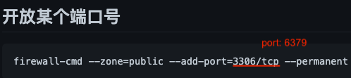
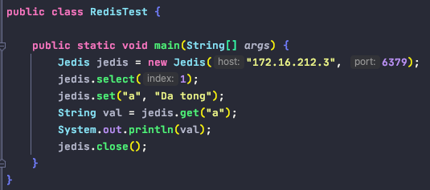

# Redis - 为性能而生

0. NoSQL (Not Only SQL)

        - key-value模式进行存储, 大大增加了数据库的扩展能力
        - 不遵循SQL标准
        - 不支持事务ACID
        - 性能远超SQL (内存 vs 磁盘)
        
        NoSQL应用场景: 
            - 数据高并发读写
            - 海量数据读写
            - 数据高可扩展性
        
        NoSQL不适用场景:
            - 需要事务支持
            - 基于sql的结构化查询存储, 处理复杂的关系 (关联), 或条件查询
       
       
1. Redis

        - key-value存储系统, 数据缓存在内存中
        - 支持多种数据类型: string, list, set, zset, hash
        - 支持多种排序, push/pop, add/remove, 以及交集并集差集等丰富的操作
        - 周期性地将数据写入磁盘或把修改操作写入追加的记录文件
        - 可实现master-slave主从同步
        - 默认有16个数据库
        
        
        Redis使用场景:
            - 配合关系型数据库做告诉缓存
                * 高频词, 热门访问的数据, 降低数据库IO
                * 分布式架构, 做session共享
    
    
2. Linux 编译&安装 Redis
        
        - 解压缩文件
        - make (编译)
        - make install (安装)
        
        默认安装目录: /usr/local/bin
        Redis目录:
            - redis-benchmark: 性能测试工具, 在服务启动后执行可以查看运行主机的性能
            - redis-check-aof: 修复有问题的AOF文件
            - redis-check-dump: 修复有问题的dump.rdb文件
            - redis-sentinel: Redis集群使用
            - redis-server: Redis服务器启动命令
            - redis-cli: 客户端, 操作入口

3. 启动Redis服务器和Redis客户端

        - copy一份redis.conf到另一个目录
        - 修改redis.conf中的daemonize no为yes, 使Redis可以在后台运行, 而不占用操作界面
        - 启动redis-server /dir/redis.conf
        - 启动redis-cli
        - 测试: ping ---> PONG (Redis默认端口号为6379)

4. Redis 是单线程 + 多路IO复用技术

        - memcached: 多线程 + 锁
        

5. Redis 常用命令
    
        - keys *:                   查询当前库的所有键
        - exists <key>:             判断某个键是否存在
        - type <key>:               查看键的类型
        - del <key>:                删除某个键
        - expire <key> <seconds>:   为键值设置过期问题, 单位是秒
        - ttl <key>:                查看还有多少秒过期, -1表示永不过期, -2表示已过期
        - dbsize:                   查看当前数据库的key的数量
        - flushdb:                  清空当前库
        - flushall:                 通杀全部库
        
        
6. Redis数据类型 -- 5种

        key + string, set, list, hash, zset

7. Jedis -- Redis的Java客户端
        
        - 0. 导入jedis.jar包并加入项目类路径

        - 1. 开放防火墙的6379端口

        
       - 2. 修改redis-server的redis.conf配置文件
            a. comment "bind 127.0.0.1"
            b. set "protected-mode no"
        
       - 3. 开启redis-server服务端as deamon process
        
       - 4. Java端测试

        

8. Redis 事务

        - 一个单独的隔离操作, 事务中的所有的命令都会序列化, 按顺序执行
        - 串联多个命令防止别的命令插队 (批量指令处理)
        - 事务命令: 
                multi: 开启事务
                exec: 执行事务
                discard: 取消事务
                watch: 监视一个或多个key, 如果在事务执行之前这个或这些key被其他命令所改动, 那么事务将被终断
                unwatch: 取消watch命令对所有key的监视
                
        - Redis事务的三个重要保证:
            a. 批量操作在发送EXEC命令前被放入队列缓存
            b. 收到EXEC命令后进入事务执行, 事务中任意命令执行失败, 其余的命令依然被执行, 并不会回滚
            c. 在事务执行过程, 其他客户端提交的命令请求不会插入到事务执行命令序列中
            
        - 悲观锁 vs 乐观锁：
            悲观锁: 每次去拿数据的时候都认为别人会修改, 所以每次在拿数据的时候都会上锁, 这样别人想拿这个数据就会block直到它拿到锁。传统的关系型数据库里面就用到了很多这种锁机制, 比如行锁, 表锁等, 读锁, 写锁等, 都是在做操作之前先上锁。
            
            乐观锁: 每次去拿数据的时候都认为别人不会修改, 所以不会上锁, 但是在更新的时候会判断一下在此期间别人有没有去更新这个数据, 可以使用版本号等机制。乐观锁适用于多读的应用类型, 这样可以提高吞吐量。Redis就是利用这种check-and-set机制实现事务的。
    
